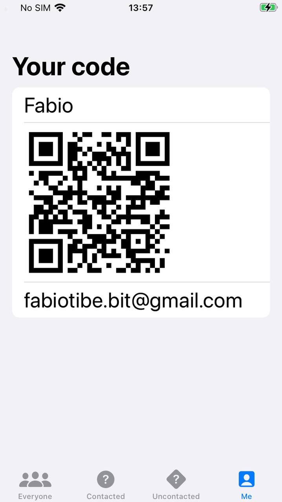
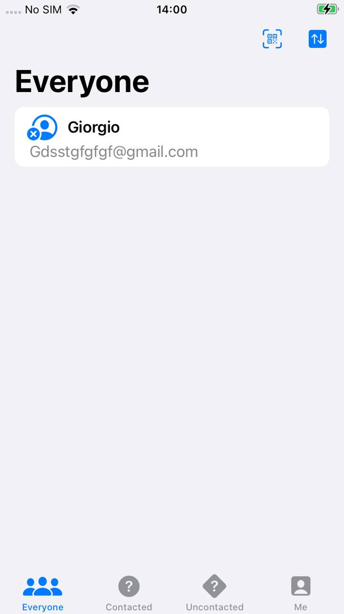
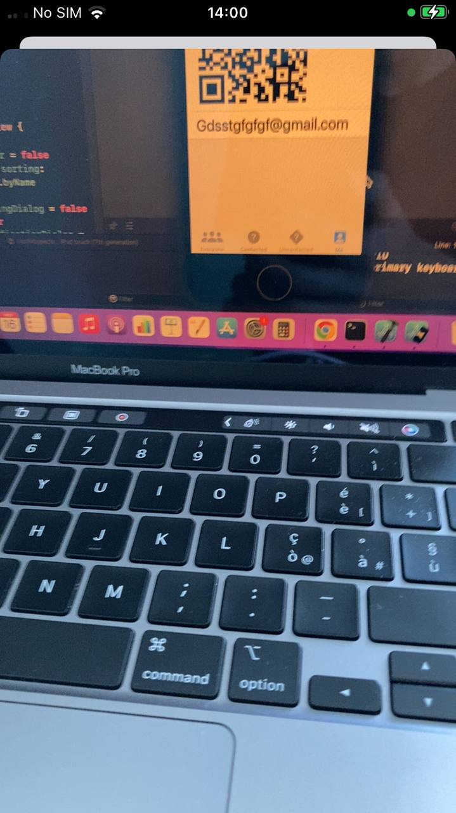

# Hot Prospects
You can use this application to track people that you meet at conferences. It shows a QR code that stores your attendee information and allows you to scan others' QR codes. When you scan a code, it gets added to a list so that you can see people's contacts for a later follow-up.

## Project Structure
The project has 2 modules:
* **Hot Prospects**: the actual application
* **Techniques**: made of files that demonstrate the knowledge needed to build this application
### MeView

### Prospects View

### Code Scanner View

## Requirements
You will need the following requirements to build and run this project:
* iOS 15
* Xcode 13

## Credits
This application is part of the 100 days of SwiftUI course offered by Paul Hudson.

## License
MIT License

Copyright (c) 2022 Fabio Tiberio

Permission is hereby granted, free of charge, to any person obtaining a copy
of this software and associated documentation files (the "Software"), to deal
in the Software without restriction, including without limitation the rights
to use, copy, modify, merge, publish, distribute, sublicense, and/or sell
copies of the Software, and to permit persons to whom the Software is
furnished to do so, subject to the following conditions:

The above copyright notice and this permission notice shall be included in all
copies or substantial portions of the Software.

THE SOFTWARE IS PROVIDED "AS IS", WITHOUT WARRANTY OF ANY KIND, EXPRESS OR
IMPLIED, INCLUDING BUT NOT LIMITED TO THE WARRANTIES OF MERCHANTABILITY,
FITNESS FOR A PARTICULAR PURPOSE AND NONINFRINGEMENT. IN NO EVENT SHALL THE
AUTHORS OR COPYRIGHT HOLDERS BE LIABLE FOR ANY CLAIM, DAMAGES OR OTHER
LIABILITY, WHETHER IN AN ACTION OF CONTRACT, TORT OR OTHERWISE, ARISING FROM,
OUT OF OR IN CONNECTION WITH THE SOFTWARE OR THE USE OR OTHER DEALINGS IN THE
SOFTWARE.
